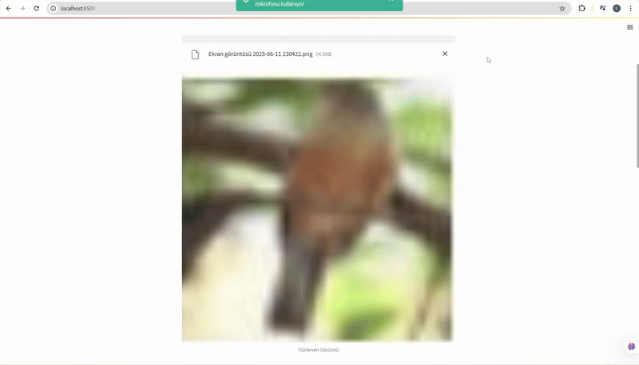

# GAN4SecurePatches

# 🔐 GradCAM Destekli Görüntü Şifreleme ve GAN ile Onarma Sistemi

Bu proje, görüntülerdeki anlamlı bölgelerin **Grad-CAM** ile belirlenip adaptif olarak **AES-128/256** algoritmalarıyla şifrelenmesini ve bu şifreli yama (patch) verilerin **GAN** yardımıyla yeniden oluşturulmasını hedefler. Ayrıca **CNN** modeli ile sınıflandırma yapılır ve **Grad-CAM** ile modelin dikkat ettiği alanlar görselleştirilir.

## 🎯 Amaç
- 🧠 CNN modeliyle görüntü sınıflandırması
- 🔥 Grad-CAM ile dikkat haritalarının çıkarılması
- 🔐 GradCAM skoru yüksek patch'lerin AES-256 ile, düşüklerin AES-128 ile şifrelenmesi
- 🤖 GAN ile bu patch'lerin yeniden üretilmesi ve kalite ölçümü (PSNR / SSIM)

---

## 🚀 Özellikler
- [x] CIFAR-10 ile örnek eğitim ve test
- [x] PyTorch tabanlı özelleştirilmiş CNN mimarisi
- [x] Streamlit arayüzü ile demo uygulama
- [x] Adaptif AES şifreleme
- [x] GAN ile şifreli veriden geri üretim
- [x] Grad-CAM görselleştirme
- [x] Metriklerle kalite değerlendirme (PSNR, SSIM)

---

## 🧠 Kullanılan Teknolojiler
- Python 3.9+
- PyTorch, torchvision
- NumPy, Matplotlib, Streamlit
- Crypto (pycryptodome)
- scikit-image (skimage)

---

## 🗂️ Dosya Yapısı

project/
├── models/
│ ├── cnn_model.pth
│ └── gan_generator.pth
├── src/
│ ├── cnn_model.py
│ ├── gan_model.py
│ ├── gradcam.py
│ └── utils.py
├── app.py # Streamlit arayüzü
├── train_cnn.py # CNN eğitimi
├── train_gan.py # GAN eğitimi
├── requirements.txt
└── README.md

