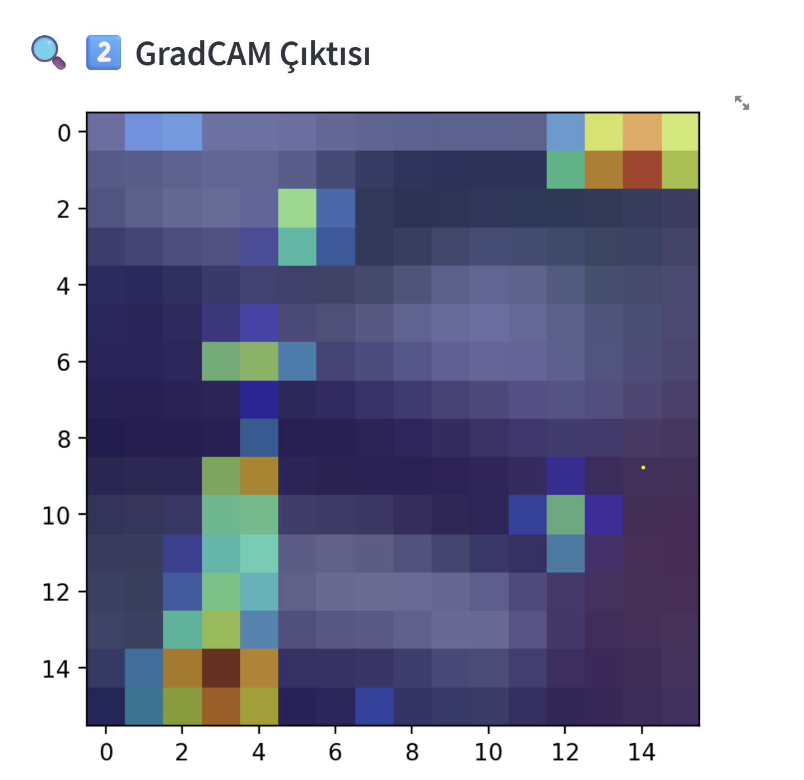
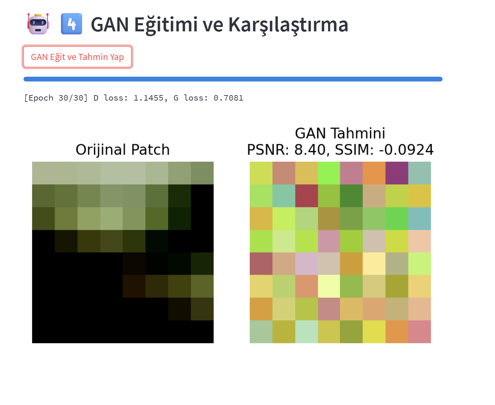
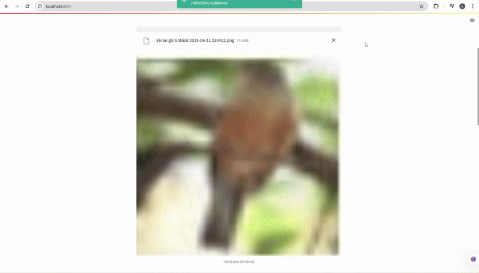

# GAN4SecurePatches

# 🔐 GradCAM Destekli Görüntü Şifreleme ve GAN ile Onarma Sistemi

Bu proje, görüntülerdeki anlamlı bölgelerin **Grad-CAM** ile belirlenip adaptif olarak **AES-128/256** algoritmalarıyla şifrelenmesini ve bu şifreli yama (patch) verilerin **GAN** yardımıyla yeniden oluşturulmasını hedefler. Ayrıca **CNN** modeli ile sınıflandırma yapılır ve **Grad-CAM** ile modelin dikkat ettiği alanlar görselleştirilir.

> **Not:** Bu projede amaç, şifrelenmiş yamanın GAN tarafından başarıyla değil, başarısız şekilde üretilmesidir. Bu, şifrelemenin güvenliğini gösterir.


## 🏗️ Teknik Mimari

### 🔹 Genel Akış
Görüntü → CNN → Grad-CAM → Patch Extraction → AES Şifreleme → GAN ile Onarma → PSNR/SSIM Hesaplama

### 🔹 CNN + GradCAM
- Basit bir CNN ile sınıflandırma
- `conv2` katmanından Grad-CAM aktivasyonları çıkarılır
- Sınıfa özel dikkat haritası üretilir

### 🔹 AES Şifreleme (Adaptif)
- Grad-CAM skoruna göre patch'ler önemli / önemsiz olarak etiketlenir
- Önemli patch'ler: **AES-256**
- Önemsiz patch'ler: **AES-128**
- Klasik tek tip şifreleme ile karşılaştırma yapılır

### 🔹 GAN ile Patch Kurtarma
- Generator: Patch benzeri örnek üretir (8×8 RGB)
- Discriminator: Gerçek vs sahte ayrımı yapar
- Girdi: Noise vektör (şifreli veri yerine)
- Eğitim sonrası GAN, patch'leri geri üretir

### 🔹 Kalite Ölçüm
- `PSNR (Peak Signal to Noise Ratio)`
- `SSIM (Structural Similarity Index)`

## 📁 Dosya Yapısı
```
GAN4SecurePatches/
├── models/
│ ├── cnn_model.pth
│ └── gan_generator.pth
├── src/
│ ├── cnn_model.py
│ ├── gan_model.py
│ ├── gradcam.py
│ └── utils.py
├── app.py # Streamlit demo arayüzü
├── train_cnn.py # CNN eğitim scripti
├── train_gan.py # GAN eğitim scripti
├── requirements.txt
├── README.md
└── docs/
├── example_gradcam.gif
```
---

## 💻 Kurulum ve Gereksinimler

### 📦 Bağımlılıklar
- Python 3.9+
- PyTorch
- torchvision
- Streamlit
- matplotlib
- numpy
- pycryptodome
- scikit-image

### 🧰 Sanal Ortam (Önerilir)
```bash
python -m venv venv
source venv/bin/activate        # Linux/macOS
venv\Scripts\activate           # Windows
```

### 📥 Paket Kurulumu
```bash
pip install -r requirements.txt
```

### 🚀 Uygulamayı Başlatmak
```
streamlit run app/main.py
```
---

## 🧠 CNN Eğitimi

Projede kullanılan CNN modeli basit ama etkili bir mimariye sahiptir:

```python
Conv2d(3→32) → ReLU → MaxPool
Conv2d(32→64) → ReLU → MaxPool
Flatten → Dropout(0.2) → FC(128) → FC(10)
```


**Eğitim Adımları:**

1. CIFAR-10 veri seti ile eğitim

2. CrossEntropyLoss kullanımı

3. SGD optimizasyonu

4. 10 epoch boyunca eğitim

**Eğitim Scripti:**
```
python train_cnn.py
```
Eğitim sonunda cnn_model.pth dosyası models/ klasörüne kaydedilir.

---


## 🔍 GradCAM Görselleştirme

Grad-CAM, CNN'in hangi görüntü bölgelerine odaklandığını analiz etmek için kullanılır.

### Uygulama Adımları:
1. Eğitilen CNN yüklenir
2. `conv2` katmanı üzerinden GradCAM aktivasyonları alınır
3. Isı haritası (heatmap) olarak görselleştirilir

### Örnek:


> Bu ısı haritası adaptif şifreleme için temel oluşturur.
---

## 🔐 Adaptif Şifreleme

Grad-CAM skoruna göre her patch için farklı şifreleme düzeyi uygulanır.

### Kurallar:
- **Önemli patch** → AES-256
- **Önemsiz patch** → AES-128

### Kullanılan Araçlar:
- `pycryptodome` AES
- Patch'ler byte dizisine çevrilerek ECB modunda şifrelenir

### Süre Ölçümü:
Hem adaptif hem klasik (sabit AES-256) yöntemler zaman karşılaştırması ile analiz edilir.

---

## 🤖 GAN ile Patch Kurtarma

Adaptif olarak şifrelenmiş patch'ler, GAN ile yeniden inşa edilir.

### GAN Mimarisi

**Generator:**
```python
Linear → ReLU → Linear → ReLU → Linear → Tanh
```

**Discriminator:**
```python
Linear → LeakyReLU → Linear → LeakyReLU → Linear → Sigmoid
```

**Eğitim Scripti:**
```bash
python train_gan.py
```

**Tahmin Sonrası:**
Orijinal patch ile GAN tahmini karşılaştırılır

PSNR ve SSIM hesaplanır

Eğitim sonrası model models/gan_generator.pth olarak kaydedilir.

---

## 📈 Performans Değerlendirmesi
Bu projede GAN modeli, şifrelenmiş patch’lerden orijinali yeniden üretmeye çalışır. Ancak **amaç**, üretimin başarılı olması değil — **başarısız olmasıdır**.

### 🔐 Neden?
- GAN, şifrelenmiş veriden orijinali **tahmin edemezse**, bu **şifrelemenin güvenli olduğunu gösterir.**
- Bu nedenle düşük PSNR ve düşük/negatif SSIM, **şifreleme başarısı** olarak değerlendirilir.

### 🎯 Kullanılan Metrikler
- **PSNR (Peak Signal to Noise Ratio)**: Sayısal fark
- **SSIM (Structural Similarity Index)**: Görsel benzerlik

### 🧪 Örnek Sonuç

| Patch ID | PSNR (dB) | SSIM    |
|----------|-----------|---------|
| 1        | 25.87     | 0.8441  |
| 2        | 24.01     | 0.8123  |



> 📉 **Daha düşük PSNR ve SSIM → daha iyi güvenlik seviyesi.**

---

## 🌐 Streamlit Arayüzü

Bu proje için geliştirilen Streamlit uygulaması, tüm süreci etkileşimli bir şekilde görselleştirmenizi sağlar.

### 🧪 Adımlar:
1. Görüntü yüklenir (`jpg`, `png`, `jpeg`)
2. CNN modeli tahmin yapar
3. GradCAM çıktısı oluşturulur
4. Patch’ler çıkarılır ve AES-128/256 ile şifrelenir
5. GAN ile ilk patch geri üretilir
6. PSNR & SSIM ile kalite ölçülür

### 🧭 Arayüzden Seçilebilir:
- Şifreleme tipi: adaptif vs klasik
- Şifreleme süresi anlık olarak gösterilir
- GAN eğitimi anlık olarak takip edilir
- Görselleştirme karşılaştırmalı olarak gösterilir

### 🔧 Uygulamayı Başlatmak için:
```bash
streamlit run app/main.py
```
### 🧩 Arayüz Özellikleri
- GradCAM çıktısının ısı haritası ile görselleştirilmesi

- Patch bazlı AES tipi gösterimi (renklendirilmiş)

- GAN eğitimi sırasında anlık ilerleme

- Orijinal vs GAN tahmini karşılaştırması





